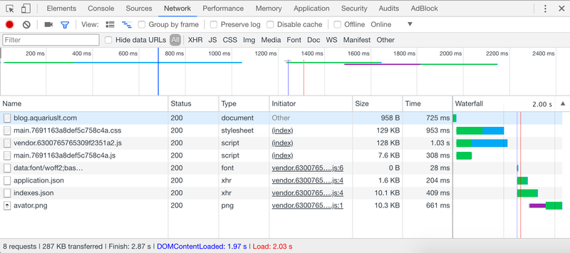
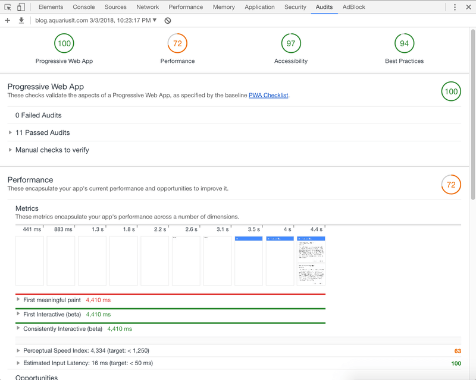

# Latest Update on Blog App

结合最近学到的一些知识，了解的一些规范，和实践过的一些新姿势，重构了 Blog 的整个应用。目前 Vue Branch 版本从`4.0.0-beta` 到了`4.0.1` ，算是可以标记 release 的一个版本了。

[项目地址](https://github.com/aquariuslt/blog)不变。(除了最近更新过一次 Github account 的 url，开头从大写变成小写，对其他第三方服务迁移的时候有点麻烦)。

## Refactor Background

其实是很少符合很多最佳实践

- 测试流程不完整
- 代码抽象结构不够好
- 依赖升级不够及时
- Markdown 功能化不够完整(其实这次重构花了很多时间都没有做好)
- 之前 Gulp 的部分功能 发现 Webpack 已经有比较成熟的方案可以实现，需要替换

## New Features

目前添加的新功能：

- 提供了`feed.xml`，支持 RSS 功能
- 支持 Github Pages SEO
- 支持国际化
- 同时支持[Travis-CI](https://travis-ci.org/aquariuslt/blog/)，[Circle-CI](https://circleci.com/gh/aquariuslt/blog) 构建和发布
- 将覆盖率报告展现在[coveralls.io](https://coveralls.io/github/aquariuslt/blog)中

## Structure/Design/Dependencies Update

目前代码结构/框架选型/测试流程上的改进包括好几个方面

### Config Design

- 修改了入口配置文件`application.yml`的 schema，结构更加扁平
- 抽离`google site verification`到配置文件里

### Build Flow

- 将读取`*.md`文件的工具类，从 Gulp Tasks 中抽取出来，目的是将来该工具类可以单独分离成一个模块。目前该模块功能是根据源代码生成合适的 api-schema 的内容，并且在`marked`的功能上做了一个 wrapper，实现自定义 header，自定义代码区块高亮，自定义 id 生成样式等功能
- 添加生成符合 RSS 规范的相关文件的 Gulp Tasks
- 添加测试相关的 Gulp Tasks
- 添加生成静态子页面的 Gulp Task

### Testing Flow

- 目前的测试流程，与语言框架无关的部分，主要是使用`karma` + `webpack` + `mocha` + `sinon` + `chai` +`puppeteer`来构建整体的测试流程。
- 覆盖率报告方面，主要是使用了`karma`的`spec coverage reporter`插件 来生成较为通用的`lcov.info`报告文件，方便与各大开放的覆盖率报告平台集成。
- 与语言框架相关的部分，根据 beta 版本的`@vue/test-utils` 的官方推荐单元测试编写方法改写了各大组件的测试前置代码(最新的几个版本坑有点多，大概是与那些在代码里面强行加入了 SSR 的检测之类的改动导致体验挺糟糕的)
- 使用了`moxios`这个`axios`官方的 mockup lib 来做模拟 http 请求方面的测试

### Dependencies/3rd Party Lib Selection

- PWA 相关配置方面，移除了从利用`sw-preache`构建出 PWA 相关文件的 Gulp，改而采用`offline-plugin` + runtime 模式来切分开发环境与生产环境的的加载。
- webpack 和相关官方插件升级到 3 的最新版(重构之间 webpack 还发布了 4，但是有点破坏性的改动还没找到合适的替代方案，所以暂时观望和调试中)
- 添加`vue-i18n`做国际化
- 升级 babel 版本到 6 的最新版，重新配置了 babel 相关的配置文件，统一到较合适的阶段
- `vue-material`也升级到了 v1.0-beta 版本，为新的 API 修改一轮代码

## Benchmark

目前首次页面加载总共需要 280KB 的流量。 

 重新用 Chrome 的 Audits 工具做了一次测试(中间有根据提示的一些最佳实践准则进行优化) 之后，主要痛点是首次渲染页面时间比较长。

## TODO

- 重新思考 Markdown 转译工具部分代码的选型(当初选型用 marked 真是真是后悔，完全是照搬 perl 实现)
- 补全没写的一些单元测试样例
- 更新`vexo-cli`提供详细的文档和遵循设计规范的背书说明
