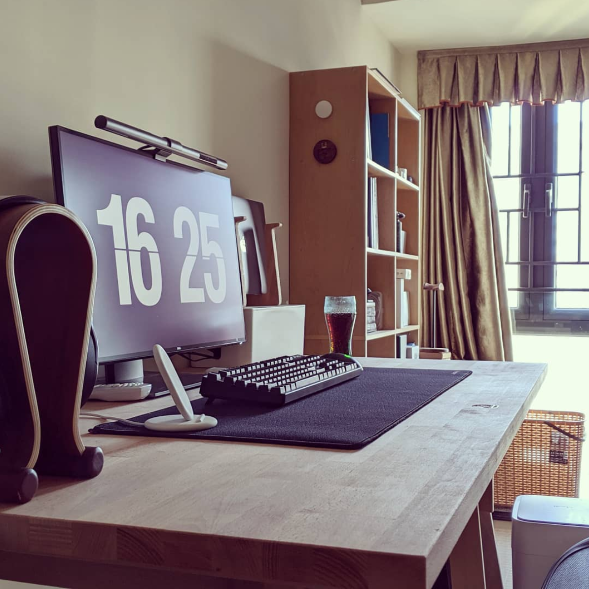

# Year in Review 2019

新年伊始，适逢 2019-nCov 疫情，多了几天在家办公的时间。

正好回顾下忙碌的 2019 年。

## Movement

---

19 年 4 月，得知房租将上涨后，找了一家新的房子，从步行上班距离的城中村搬到了骑车上班距离的远一点的空公寓。

家具又是自己买了一番(虽然大出血但是内心自我感觉住宿品质回到了在珠海的时候)。

这次主要都从宜家购置的新家具，电脑桌/床/床头柜 都是山榉木材料 + 原木色，风格比较一致。

有空可以整理下 2019 年购置的装备列表。

现在下班后回到家终于有一丝轻松躺在椅子上的感觉了。

## Reading

---

说是阅读其实也不算是，因为今年读的有一部分属于一些入门工具书，并不是每本都可以反复阅读，何况还有一些还没读完

好歹是动物书系列，也都简介下

- Kubernetes 即学即用 [https://item.jd.com/12476325.html](https://item.jd.com/12476325.html) 100%
- Kubernetes 经典实例 [https://item.jd.com/12446081.html](https://item.jd.com/12446081.html) 80% 上面两本都属于比较薄的 kubernetes 入门工具书了，不同的译者水平讲述了一些 k8s 官方原生的概念，阅读顺序稍微比官方文档要容易理解一些。推荐指数: ★★★
- 数据密集型应用系统设计 [https://item.jd.com/12437624.html](https://item.jd.com/12437624.html) 25% 大名鼎鼎的 DDIA，在中国电力出版社的翻译版本出来之前，在 Github 上粗略瞟过一些用户自己翻译的版本，很多都不能完全做到 "达" 字。

这本书译者水平相对较高，所以针对翻译中提到的种种案例，都能够很好的表达出来。在工作了若干年后接触到这本书，开头阶段会得到许多共鸣，中间则可以在很多经典案例与底层数据结构解析的过程中，得到很多工程化的经验、技术选型的依据。

还没细读完，但已经补到了很多知识，强烈推荐

推荐指数: ★★★★★

- 上瘾 (Hooked) [https://item.jd.com/12203529301.html](https://item.jd.com/12203529301.html) 100%

非技术书籍。阅读过程比较轻松，可能算是产品向的一些业余书籍。不提供推荐指数

## Apps

---

2019 年新增订阅软件:

### Notion

一款功能比较全的笔记、看板软件。

个人看重以下一些优点

- 界面好看
- 全平台支持 (Web/iOS/Android)
- 近似 Markdown 的编辑体验

一些比较纠结的缺点

- 导出成 Markdown 格式时，代码片段格式不尽人意
- 一些中文字符支持不够好

## Work

---

工作任务一直很繁重。

在五六个项目直接切换不同开发角色，经常有计划以外的线上问题要处理。基本上已经违反了很多 Engineering 的基本原则。

这纵使令人难受，亦是挑战。

希望假期能够汇总过去的一些案例，调整过来。
