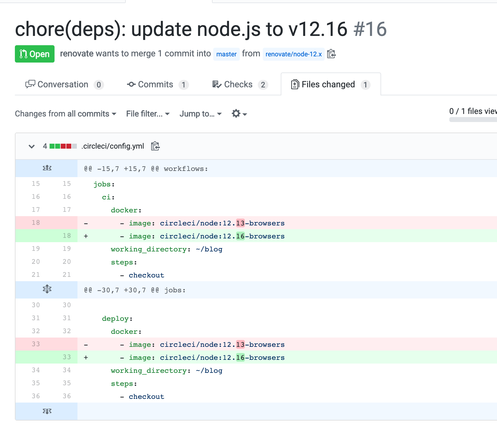

# 使用 renovate 监控第三方依赖更新

## 背景

依赖更新管理曾一直是我容易纠结的一个问题。

我希望一直保持我的仓库使用的第三方 package 一直能保持 **安全情况下** 的最新版本，

随着最新版本的更新，一般伴随着以下几种用户关心的内容：

- fixing: 修复了一些 bug
- performance tuning: 一些性能优化
- feat: 一些新的功能
- BREAKING CHANGES: 这个版本相对老版本是否有破坏性的更变，可以帮助开发者决策是否直接升级(亦或是不升级，或先兼容后升级)

不管是使用什么语言的项目，对应生态中，成为事实标准的包管理器，一般都会提供如下的依赖更新相关功能：

- 查找项目中已安装的依赖版本，对比包管理器 registry 上的最新可升级版本，并提示最新版本可用
- 在按照原依赖描述文件安装依赖时，可提示开发者有版本更新

对于接触的比较多的 node 项目，他的事实标准(在我心中的)可能是 `yarn` 。

因为 npm 及其 package 的版本号设计，遵循了 [semver versioning](https://semver.org/) 的一些基本原则，使得更新依赖稍微能程序化一点。

在简单的情况下，对于常见的 node + singlerepo 类型项目，我一般怎么做?

我使用的是 yarn 的 `upgrade-interactive --latest`

官方文档: [https://classic.yarnpkg.com/en/docs/cli/upgrade-interactive/](https://classic.yarnpkg.com/en/docs/cli/upgrade-interactive/)

通过这种手动在本地执行命令的形式，可以手动的获取项目所依赖的 npm package 的最新版本与本地依赖描述文件之间的差异，以及提供一个交互式的命令供你选择你想要更新的部分 packages。

之后在下载安装最新版本的依赖时，同时把那些依赖的最新版本的版本号持久化到以来描述文件 `package.json` 中去。

毫不犹豫的说，对于开源(托管在 github 上的 public repo)，亦或是依赖了一些私有 registry 的 package 的代码仓库，这种人工更新的方式还是比较有效的。

## 现状

这种情况会有什么缺陷呢?

把目前的人工更新方案，拆分成两种类型的缺陷:

1. 人工执行命令以主动检查更新 (主动拉取)
2. 对于 lerna + monorepo 而言，yarn 的 `upgrade-interactive` 对 monorepo 没有很好的支持

人工执行命令以主动检查更新，对于依赖个数上百、数百的项目来讲，着实有点麻烦。相当于一个人工轮询去检查是否有更新，而且放到开发者这方的话，开发体验不会很好。

稍微好的一点方案，是自动化的执行这些更新脚本，并开发一个类似 `-y` 一样的参数来实现静默允许直接更新依赖，以跳过交互式命令的步骤。

对于 lerna + monorepo 呢?

yarn 的 `upgrade-interactive` 没能很好的支持，技术原因上是因为 lerna 在执行命令 `bootstrap` 的过程中，对 monorepo 内具有互相依赖关系的私有子项目，并不是直接在每个子仓库下直接进行 `npm install` or `yarn install` 。而是会拆分成几个步骤，这里为了简述，描述成几步:

1. 对 monorepo 下的多个 package.json 进行 backup，复制一份备份版本
2. 对 monorepo 下的多个 package.json 进行修改，移除 monorepo 的私有依赖声明
3. 在每个仓库下分别执行 install 命令，此时能确保都能从远程的 registry 上下载其他非私有依赖
4. 进行 symlink，将私有依赖创建 symlink，根据计算好的依赖关系，连接到每个子项目的 `node_modules` 对应的目录中去
5. 将备份版本的多个 package.json 归回原位

由于 `yarn upgrade-interactive` 并不能识别 package.json 中的私有依赖，在 monorepo 中执行此命令，会使得由于无法在远程 registry 中查找到私有依赖，导致错误退出。

yarn 在最近发布了 v2 大版本，不知道对他原生的 monorepo (workspace) 支持，是否会考虑到这里的增强。

这是我认为人工执行 `yarn upgrade-interactive` 所存在的问题。

那么常规的开源项目，或者我曾了解的开源项目怎么做?

对，那就是代码仓库平台集成的一些依赖监控服务，在没有讲到今天的主题之前，我所了解到的是:

- [https://dependabot.com/](https://dependabot.com/) depent bot
- [https://david-dm.org/](https://david-dm.org/) david-dm 专门为 node.js 类 repo 提供依赖版本监控

有一说一 david-dm 确实比较菜了，作为第三方服务基本处于不可用的状态。

depentbot 可以提供监控多语言的依赖更新、协助更新依赖切提 Pull Request 等自动化服务。

然而在轻度体验后的结果，发现有几点不太理想:

1. 不能自动识别仓库的主要编程语言，需要在其官方平台网站上进行手动确认
2. 对于 monorepo 的问题，直至 2020 年 2 月底也没有好的解决方案

## 遇见 Renovate

最近一段时间比较关注 NestJS 社区及其成长，在学习源码时了解到一些相关的 CI 方面的实践。

在此过程中，了解到他们为了解决监控依赖更新问题，使用的服务是 Renovate。

### Renovate 是什么

Renovate 是一家名为 WhiteSource 的公司开发的一项适用于多种语言的依赖更新监控服务。目前在 Github 上以 Github Apps 的形式，可以为接入此 Apps 的项目提供依赖更新监控相关的服务。

## Renovate 使用体验

简单来讲，目前我在 Github 上使用 Renovate 的时间相对少，但是满足了我目前对依赖更新管控的基本需求，还有一些意外惊喜。

简要分享下，在安装、使用 renovate 中的一些过程。

### 1. 安装 renovate

与常见的 Github Apps 一样，首先在 Github Market place 搜索 renovate 并进行安装，按需授予权限。

[https://github.com/marketplace/renovate](https://github.com/marketplace/renovate)

### 2. 配置 renovate

安装 renovate 之后无须手动操作，等待即可。

此时 renovate 将会扫描你授予权限的仓库，做一些简要分析，分析你的各个项目主力语言、依赖管理方式，之后将会对哪些可以被通过 renovate 管控更新依赖的仓库，分别提交一份 Pull Request.

这个 Pull Request 的标题叫做 **Configure Renovate，**中间附带了一个文件更变，便是他会在项目的更目录下添加 `renovate` 的配置文件，名为 `renovate.json` 。

这个配置文件描述了一些 renovate 管理此仓库依赖的相关选项，默认生成的 `config:base` 已经能够满足日常需要。

如果开发者很不爽在项目根目录增添这样一个 json 配置文件，可以按照他们官方配置发现的目录查找顺序，移入到 `.github` 目录下。(具体查找规则，官方有较为详细的说明文档)


### 3. Pin Dependencies

合入第二点的 PR 后，不久变会收到第二个初始化类型的 PR: Pin Dependencies。

顾名思义，这里的意思是锁定目前的依赖版本，且为以后持续接受依赖更新做准备。

以 Node 类型仓库来讲，这个 PR 的具体内容，便是先在每个 package.json 内容中，将依赖的版本无损更新到最新版本号 (指符合 semver versioning 的更新规则) 之后，去除 package.json 中每项依赖版本号之前的 `^` 和 `~` ，以将模糊的 semver versioning 版本监控行为变成确定的版本号。

### 4. Update Dependencies

在第三点之后，接下来的就是日常的监控依赖更新了。

每当依赖的新版本发布时，他会针对单条依赖的更新提交 PR，如果依赖中有符合标准的 CHANGELOG 也会直接加入到 PR 的 description 中。

其中，他们也会对发布到 registry 的依赖文件内容，进行 diff，以生成 renovate 自己分析的的"依赖构建产物" diff，以供查看。

在对项目的依赖描述文件扫描、分析更新这部分，能够对 monorepo 提供很好的支持。

比方说在我的 blog 项目中，有一个属于主题的子项目，该子项目依赖了一些 blog 项目的私有依赖，大概如下:

```json
{
  "dependencies": {
    "@blog/common": "^6.21.4",
    "@blog/config": "^6.21.4",
    "@loadable/component": "5.12.0",
    "@material-ui/core": "4.9.4",
    "@material-ui/icons": "4.9.1",
    "axios": "0.19.2",
    "classnames": "2.2.6",
    "clsx": "1.1.0",
    "date-fns": "2.10.0",
    "github-markdown-css": "4.0.0",
    "highlight.js": "9.18.1",
    "react": "16.13.0",
    "react-disqus-components": "1.2.2",
    "react-dom": "16.13.0",
    "react-helmet": "5.2.1",
    "react-router-dom": "5.1.2",
    "scroll-into-view-if-needed": "2.2.24",
    "typeface-roboto": "0.0.75",
    "vanilla-lazyload": "12.5.1"
  }
}
```

其中 package.json 中 `@blog` 开头的两个依赖，属于私有依赖，在 npm registry 中无法找到。对于非私有依赖， renovate 都能逐个帮你进行监控，并在版本更新的时候及时提出 PR。

### 意外惊喜

惊喜的是，在 merge PR 时，renovate 还会增加一个 `conventional commit` 的检测: 如果你在项目中显式地配置了主流的 commit lint 以及 commit message 风格检测，他会按照这些常见的风格来修改 PR 的标题:

如: [https://github.com/aquariuslt/blog/pull/38](https://github.com/aquariuslt/blog/pull/38)

标题为: chore(deps): update dependency @types/node to v13.7.7 #38

对于 circleci，也提供了的 CI 环境下的 docker-image 版本监控



## 结论与思考

### 结论

renovate 是我目前遇到的最能满足监控依赖更新的一项服务，满足了我在 Github 上的 node 项目监控依赖更新的迫切需求。

目前我所有放在 github 上的 node, java 项目都接入了该项服务。

### 思考

如果要为私有项目解决这个问题，我可能会怎么做

在公司内部，特别是一些大厂，通常有自己的内部源码仓库，如 Self-hosted Gitlab，自研的 Git 平台，还会有内部的各种 包管理对应的私有 registry。

如果需要为内部私有项目解决第三方依赖版本管控问题，renovate 的使用体验则为我们带来了一个很好的标杆。

如果有一天有空去写轮眼这个服务，我一定会从他的官方文档、配置文档、使用体验中反推基本实现，并将中间 github 操作相关 api 转成内部平台支持的 api，编写插件，设计分析服务。

也许需要下面的特性:

- 依赖描述文件扫描与发现
- 尽可能分析出可被分析的依赖版本
- 结合各种语言生态事实标准，更新依赖，生成合理的 commit message
- 对应仓库平台 Pull Request API 适配实现
