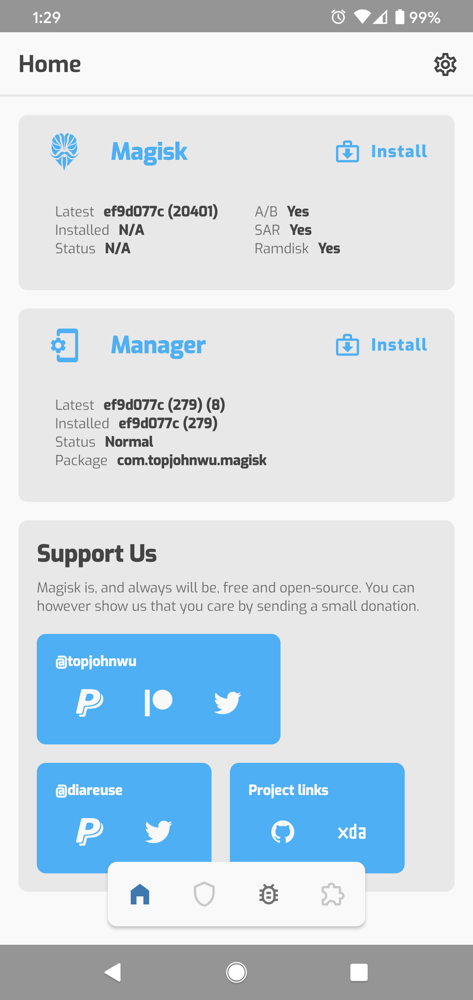
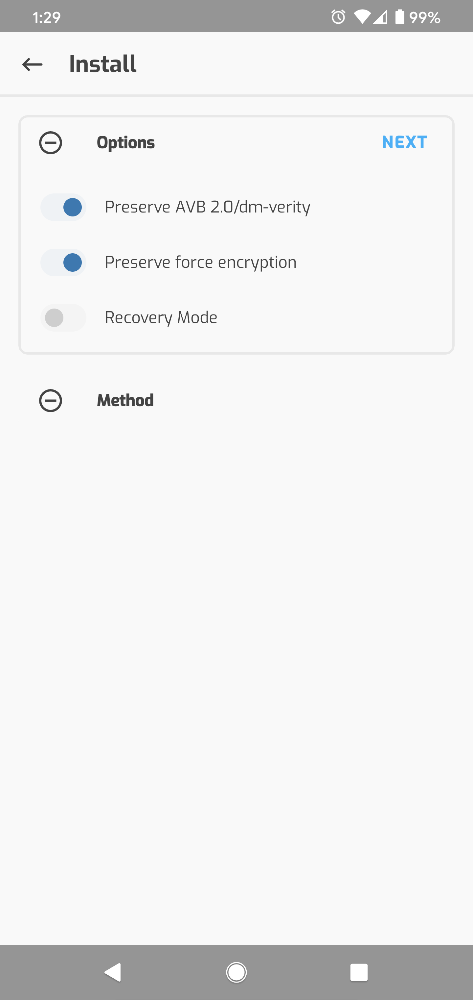
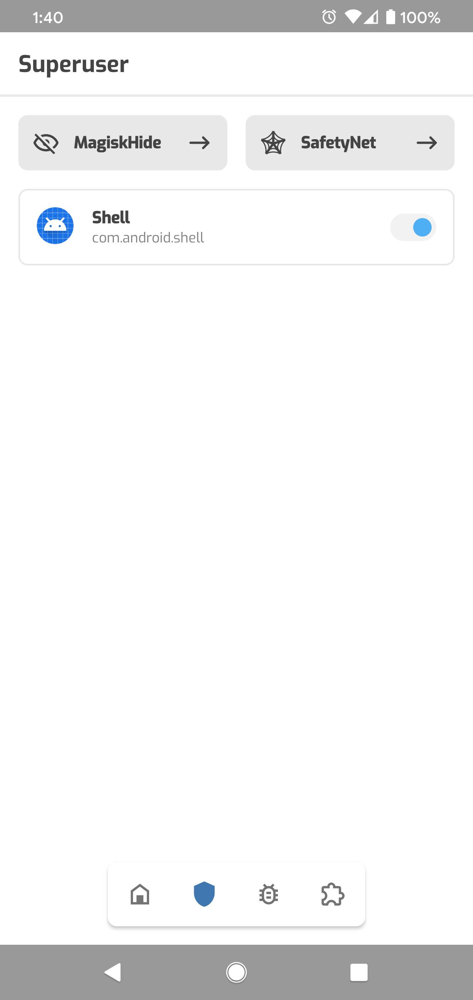
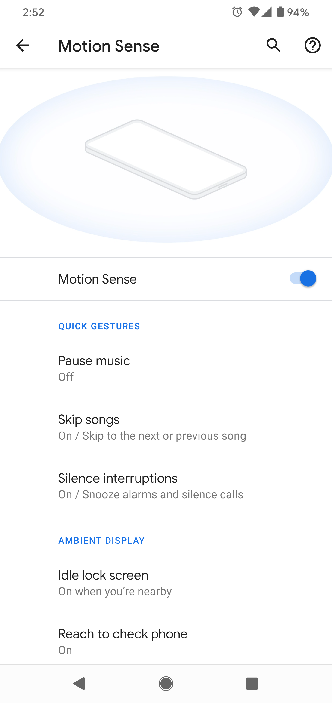

# Pixel 4 XL 在中国地区开启 Motion Sense

> 我作为 Nexus 5 / Nexus 7 / Pixel / Pixel 3 XL / Pixel 4 XL 的持有者，为了顺利地在及时更新到最新版本的系统的同时也保证在国内使用 Google 原生系统的大部分体验，必须掌握一手 root 的科学方法。

适逢 Google Pixel 4 带来了新的 Notion Sence 功能 (就是那个摆手切歌的传感器功能)，对系统的破解有着更高的要求，在每次系统打上新的安全补丁后，使用 magisk 执行的 root 都会失效一次，年纪大了机型不太行，每次都得 Google 一番几个月前执行过的操作。此文主要做记录用。

为了达到 Pixel 4 XL 开启 Notion Scene 的功能，主要参考的是去年年底 Pixel 4 发布后不久的位于 XDA-Developers 的文章进行 root，再配合一些国内特有的 Magisk 模块进行对系统开启 Location History / Motion Sense 的限制。

简而言之，顺序大致如下:

1. 使用 Magisk 对 Google Pixel 4 XL 进行 root 操作
2. 使用 Magisk 模块开启 Motion Sense

## 环境准备

硬件: 一台未 root 但已经解锁 bootloader 的 Pixel 4 ，系统安全补丁更新到最新

软件: 基础的科学上网环境，adb 环境 (adb + fastboot)，硬件对应的 Google Factory Image

手机软件: 已安装 Magisk

Google Factory Images 下载地址: [https://developers.google.com/android/images](https://developers.google.com/android/images)

> 截止编辑时最新的 Pixel 4 XL 镜像版本是 `10.0.0 (QQ2A.200305.003, Mar 2020, All carriers except AT&T)`

下载镜像文件 zip，解压 zip 文件，再解压里面的 `image-*.zip` 后的文件目录大概如下: 我们需要用到这里的 `boot.img` 镜像

```
├── coral-qq2a.200305.003
│   ├── bootloader-coral-c2f2-0.2-6118748.img
│   ├── flash-all.bat
│   ├── flash-all.sh
│   ├── flash-base.sh
│   ├── image-coral-qq2a.200305.003
│   │   ├── android-info.txt
│   │   ├── boot.img
│   │   ├── dtbo.img
│   │   ├── product.img
│   │   ├── super_empty.img
│   │   ├── system.img
│   │   ├── system_other.img
│   │   ├── vbmeta.img
│   │   ├── vbmeta_system.img
│   │   └── vendor.img
│   ├── image-coral-qq2a.200305.003.zip
│   └── radio-coral-g8150-00055-200110-b-6126839.img
```

## 1. 使用 Magisk 对 Google Pixel 4 XL 进行 root 操作

### 1.1. 将 boot.img 从电脑移动到手机

此步骤可以使用 `adb push` 命令:

个人建议将 boot.img 移动到手机的 `/sdcard/Download` 文件夹，方便记忆。 (不同版本请根据实际路径切换)

```bash
adb push coral-qq2a.200305.003/image-coral-qq2a.200305.003/boot.img /sdcard/Download
```

### 1.2. 使用 Magisk patch 传递进去的 boot.img

接着，把这个 `magisk_patched.img` 传递到 PC 上。

```bash
adb pull /sdcard/Download/magisk_patched.img patched.img
```

打开 Magisk



点击上方的 install



选择下一步 method - `select-and-patch a file`


成功创建 `magisk-patched.img`


### 1.3. 使用 adb/fastboot 进行 boot.img 修复

执行如下的三步脚本

```bash
adb reboot bootloader
fastboot flash boot_a patched.img
fastboot flash boot_b patched.img
```

应当输出如下内容:

```bash
$ fastboot flash boot_a patched.img
Sending 'boot_a' (32148 KB)                        OKAY [  0.840s]
Writing 'boot_a'                                   OKAY [  0.236s]
Finished. Total time: 1.297s


$ fastboot flash boot_b patched.img
Sending 'boot_b' (32148 KB)                        OKAY [  0.840s]
Writing 'boot_b'                                   OKAY [  0.323s]
Finished. Total time: 1.383s
```

之后重启手机进入系统，应当是已 root 的状态



## 2. 使用 adb shell 脚本开启 motion sense

> 由于三月更新后，大部分开启 Motion Sense 的 Magisk Module 都失效了，暂时以 临时脚本作为解决方案。缺点是重启失效

临时方案: 执行以下脚本已去除 Motion Sense 开启的限制

```bash
adb shell
su root
setprop pixel.oslo.allowed_override 1
setprop persist.pixel.oslo.allowed_override 1
setprop ctl.restart zygote
```

验证效果:




> Note: 2020-07-17 已向 Magisk Module Repo 提交相关插件，
> 目前可以直接使用 [Github Release](https://github.com/aquariuslt/enable-motion-sense/releases) 链接下载 zip 文件进行解压。


## References

- How to root Google Pixel 4 or Pixel 4 XL - XDA [https://www.xda-developers.com/google-pixel-4-root-magisk/](https://www.xda-developers.com/google-pixel-4-root-magisk/)
