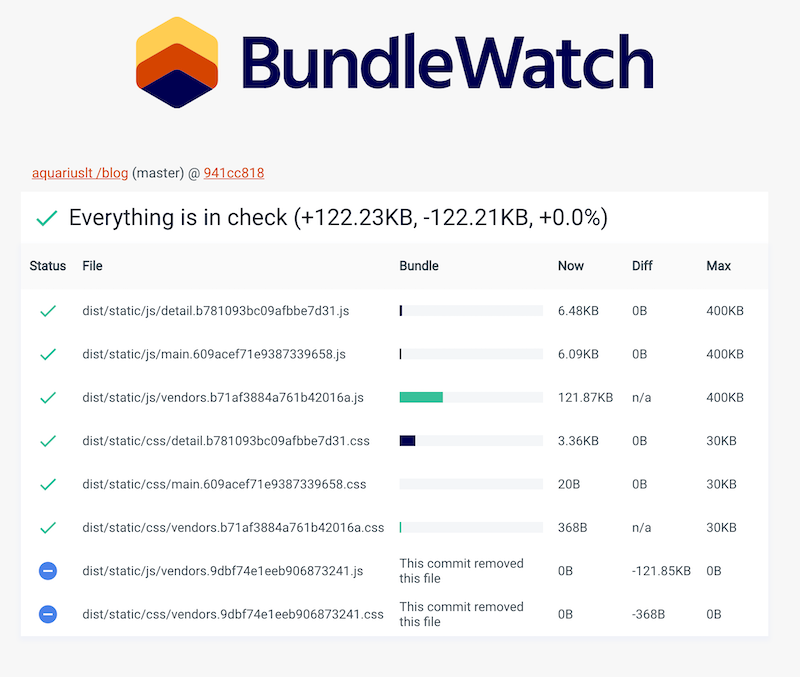

# Using bundlewatch instead of bundlesize

## 背景

在 github 上托管的开源项目，特别是对构建产物有体积要求的项目，经常会用到一个叫 bundlesize 的集成服务。

[https://github.com/siddharthkp/bundlesize](https://github.com/siddharthkp/bundlesize)

我是从 [https://developers.google.com/web/fundamentals/performance/webpack/](https://developers.google.com/web/fundamentals/performance/webpack/) 中了解到 bundlesize 这个服务的。

由于日久 bundlesize 项目失修，没人维护。以至于我之前接入了 bundlesize 并以此作为 CI Checking 的项目收到了其影响，具体表现为上传数据长时间无响应，影响了整个 CI 构建通知的时间序列。

为此，Github 上自发地来了个新的项目，来代替 bundlesize。

那就是今天要介绍的 bundlewatch。

在其官方文档中，描述了为什么要从 bundlesize 迁移到 bundlewatch (加粗部分是我选择的目的)

- **bundlesize 已经不再维护，各种 issue 没人管**
- **提供了 [bundlewatch.io](http://bundlewatch.io) 作为官方文档网站(原本这些)**
- 提供了了足够的测试覆盖率
- 有 Node API 支持 (可以程序化调用 bundlewatch)
- 提供了在线的 bundlewatch 配置校验
- 更好看的数据展示页面
- **支持自主部署 bundlewatch hosting 服务(也就是为企业内部服务提供了可能)**

本片文章内容上比较朴素，属于科普向，主要内容如下:

- 迁移之前: 我的 bundlesize 配置
- 迁移之后: 我的 bundlewatch 配置
- bundlewatch 监控效果图

## 迁移过程

### 迁移前: bundlesize 配置

在使用 bundlesize 的时候，我们需要做以下几项工作，来达到计算构建产物体积 → 设定产物体积增减红线 → 通过更新 CI Status 反馈本次 commit 质量的目的。

为此，你大概需要在你的项目上做到:

- 添加 bundlesize 作为集成服务 (在 Github 网页上操作)
- 安装 bundlesize 作为依赖
- 添加 bundlesize 配置
- 将 bundlesize 加入 CI 构建步骤 (使 bundlesize 能够通过获你的 Github Token 进行 CI Status 的反馈)

**安装 bundlesize 作为依赖**

```bash
yarn add -D bundlesize
```

**添加 bundlesize 配置 (in `package.json` )**

相对于项目根目录的构建产物，使用 glob pattern 进行文件匹配，bundlesize 将会计算每个分组下的文件大小总和，并新增一个 npm script: `bundlesize: bundlesize` 用于执行 bundlesize 计算

```json
{
  "bundlesize": [
    {
      "path": "./dist/static/js/*.js",
      "maxSize": "400 kB"
    },
    {
      "path": "./dist/static/css/*.css",
      "maxSize": "30 kB"
    }
  ]
}
```

**将 bundlesize 加入 CI 步骤**

此步需要一个有权限提交 Commit Status 的 Github Token，假设已经放在 Github Repository 的 Secrets 添加此 Token，并命名为 `BUNDLESIZE_GITHUB_TOKEN`

在 Github Actions 的 workflow 下添加一步

```yaml
- name: Check bundlesize
  run: |
    yarn build:prod
    yarn bundlesize
  env:
    BUNDLESIZE_GITHUB_TOKEN: ${{ secrets.BUNDLESIZE_GITHUB_TOKEN }}
```

### 迁移后:

整体迁移步骤也挺简单，基于已经有 `bundlesize` 相关配置的话，代码层面只需要改上面的两步：

- 添加 bundlewatch 作为集成服务 (在 Github 网页上操作)
- 将 bundlesize 依赖、配置修改为 bundlewatch
- 将 bundlesize CI 配置修改为 bundlewatch

**bundlesize 依赖、配置修改为 bundlewatch**

```bash
yarn add -D bundlewatch
yarn remove bundlesize
```

上面 npm script 也应当同步修改为 `bundlewatch: bundlewatch`

```json
{
  "bundlewatch": {
    "files": [
      {
        "path": "dist/static/js/*.js",
        "maxSize": "400 kB"
      },
      {
        "path": "dist/static/css/*.css",
        "maxSize": "30 kB"
      }
    ]
  }
}
```

**将 bundlesize CI 配置修改为 bundlewatch**

```yaml
- name: Check bundlewatch
  run: |
    yarn build:prod
    yarn bundlewatch
  env:
    BUNDLEWATCH_GITHUB_TOKEN: ${{ secrets.BUNDLESIZE_GITHUB_TOKEN }}
```

## 效果

### CI Checking on Commit Status


### 构建产物体积曲线图



## References

[https://github.com/bundlewatch/bundlewatch](https://github.com/bundlewatch/bundlewatch)
